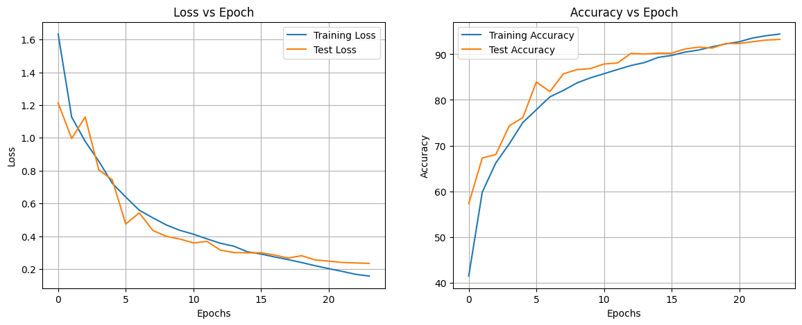
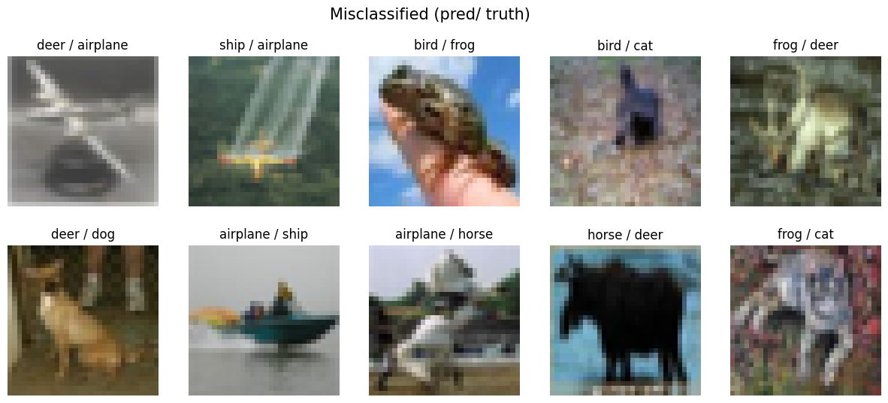

# Assignment 10 Submission


## Results

| Set   | Max Acc@Epoch | Last Epoch Acc |
|-------|---------------|----------------|
| train | 94.42@24      |  94.42         |
| test  | 93.24@24      | 93.24          |


### Per Class Accuracy 

```bash
[x] Accuracy of ::
	[*] airplane : 100 %
	[*] automobile : 96 %
	[*]     bird : 88 %
	[*]      cat : 76 %
	[*]     deer : 94 %
	[*]      dog : 95 %
	[*]     frog : 100 %
	[*]    horse : 100 %
	[*]     ship : 100 %
	[*]    truck : 85 %
```

## Model Summary

```bash
==========================================================================================
Layer (type:depth-idx)                   Output Shape              Param #
==========================================================================================
CustomResNet                             [1, 10]                   --
├─Sequential: 1-1                        [1, 64, 32, 32]           --
│    └─Conv2d: 2-1                       [1, 64, 32, 32]           1,728
│    └─BatchNorm2d: 2-2                  [1, 64, 32, 32]           128
│    └─ReLU: 2-3                         [1, 64, 32, 32]           --
│    └─Dropout2d: 2-4                    [1, 64, 32, 32]           --
├─Sequential: 1-2                        [1, 128, 16, 16]          --
│    └─Conv2d: 2-5                       [1, 128, 32, 32]          73,728
│    └─MaxPool2d: 2-6                    [1, 128, 16, 16]          --
│    └─BatchNorm2d: 2-7                  [1, 128, 16, 16]          256
│    └─ReLU: 2-8                         [1, 128, 16, 16]          --
│    └─Dropout2d: 2-9                    [1, 128, 16, 16]          --
│    └─ResBlock: 2-10                    [1, 128, 16, 16]          --
│    │    └─Conv2d: 3-1                  [1, 128, 16, 16]          147,456
│    │    └─BatchNorm2d: 3-2             [1, 128, 16, 16]          256
│    │    └─Dropout2d: 3-3               [1, 128, 16, 16]          --
│    │    └─Conv2d: 3-4                  [1, 128, 16, 16]          147,456
│    │    └─BatchNorm2d: 3-5             [1, 128, 16, 16]          256
│    │    └─Dropout2d: 3-6               [1, 128, 16, 16]          --
├─Sequential: 1-3                        [1, 256, 8, 8]            --
│    └─Conv2d: 2-11                      [1, 256, 16, 16]          294,912
│    └─MaxPool2d: 2-12                   [1, 256, 8, 8]            --
│    └─BatchNorm2d: 2-13                 [1, 256, 8, 8]            512
│    └─ReLU: 2-14                        [1, 256, 8, 8]            --
│    └─Dropout2d: 2-15                   [1, 256, 8, 8]            --
├─Sequential: 1-4                        [1, 512, 4, 4]            --
│    └─Conv2d: 2-16                      [1, 512, 8, 8]            1,179,648
│    └─MaxPool2d: 2-17                   [1, 512, 4, 4]            --
│    └─BatchNorm2d: 2-18                 [1, 512, 4, 4]            1,024
│    └─ReLU: 2-19                        [1, 512, 4, 4]            --
│    └─Dropout2d: 2-20                   [1, 512, 4, 4]            --
│    └─ResBlock: 2-21                    [1, 512, 4, 4]            --
│    │    └─Conv2d: 3-7                  [1, 512, 4, 4]            2,359,296
│    │    └─BatchNorm2d: 3-8             [1, 512, 4, 4]            1,024
│    │    └─Dropout2d: 3-9               [1, 512, 4, 4]            --
│    │    └─Conv2d: 3-10                 [1, 512, 4, 4]            2,359,296
│    │    └─BatchNorm2d: 3-11            [1, 512, 4, 4]            1,024
│    │    └─Dropout2d: 3-12              [1, 512, 4, 4]            --
├─MaxPool2d: 1-5                         [1, 512, 1, 1]            --
├─Conv2d: 1-6                            [1, 10, 1, 1]             5,120
==========================================================================================
Total params: 6,573,120
Trainable params: 6,573,120
Non-trainable params: 0
Total mult-adds (M): 379.27
==========================================================================================
Input size (MB): 0.01
Forward/backward pass size (MB): 4.65
Params size (MB): 26.29
Estimated Total Size (MB): 30.96
==========================================================================================
```

## Learning Curve 




## Misscalssification Plot

