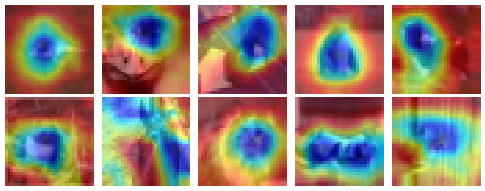
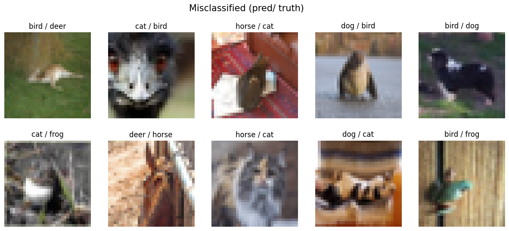
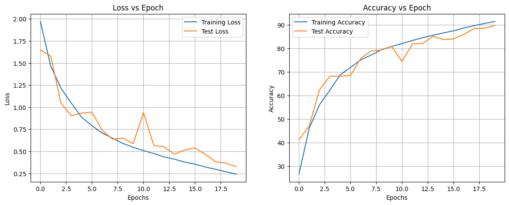

# Assignment 11 Submission

## Results

_Epochs: 20_

| Set   | Max Acc@Epoch | Last Epoch Acc |
| ----- | ------------- | -------------- |
| train | 91.48@20      | 91.48          |
| test  | 89.79@20      | 89.79          |

```bash
[x] Accuracy of ::
	[*] airplane : 83 %
	[*] automobile : 95 %
	[*]     bird : 82 %
	[*]      cat : 85 %
	[*]     deer : 90 %
	[*]      dog : 85 %
	[*]     frog : 100 %
	[*]    horse : 86 %
	[*]     ship : 94 %
	[*]    truck : 95 %
```

## Grad Cam Results



## Misclassified Images



## MoDel Summary

```bash
==========================================================================================
Layer (type:depth-idx)                   Output Shape              Param #
==========================================================================================
ResNet                                   [1, 10]                   --
├─Conv2d: 1-1                            [1, 64, 32, 32]           1,728
├─BatchNorm2d: 1-2                       [1, 64, 32, 32]           128
├─Sequential: 1-3                        [1, 64, 32, 32]           --
│    └─BasicBlock: 2-1                   [1, 64, 32, 32]           --
│    │    └─Conv2d: 3-1                  [1, 64, 32, 32]           36,864
│    │    └─BatchNorm2d: 3-2             [1, 64, 32, 32]           128
│    │    └─Conv2d: 3-3                  [1, 64, 32, 32]           36,864
│    │    └─BatchNorm2d: 3-4             [1, 64, 32, 32]           128
│    │    └─Sequential: 3-5              [1, 64, 32, 32]           --
│    └─BasicBlock: 2-2                   [1, 64, 32, 32]           --
│    │    └─Conv2d: 3-6                  [1, 64, 32, 32]           36,864
│    │    └─BatchNorm2d: 3-7             [1, 64, 32, 32]           128
│    │    └─Conv2d: 3-8                  [1, 64, 32, 32]           36,864
│    │    └─BatchNorm2d: 3-9             [1, 64, 32, 32]           128
│    │    └─Sequential: 3-10             [1, 64, 32, 32]           --
├─Sequential: 1-4                        [1, 128, 16, 16]          --
│    └─BasicBlock: 2-3                   [1, 128, 16, 16]          --
│    │    └─Conv2d: 3-11                 [1, 128, 16, 16]          73,728
│    │    └─BatchNorm2d: 3-12            [1, 128, 16, 16]          256
│    │    └─Conv2d: 3-13                 [1, 128, 16, 16]          147,456
│    │    └─BatchNorm2d: 3-14            [1, 128, 16, 16]          256
│    │    └─Sequential: 3-15             [1, 128, 16, 16]          8,448
│    └─BasicBlock: 2-4                   [1, 128, 16, 16]          --
│    │    └─Conv2d: 3-16                 [1, 128, 16, 16]          147,456
│    │    └─BatchNorm2d: 3-17            [1, 128, 16, 16]          256
│    │    └─Conv2d: 3-18                 [1, 128, 16, 16]          147,456
│    │    └─BatchNorm2d: 3-19            [1, 128, 16, 16]          256
│    │    └─Sequential: 3-20             [1, 128, 16, 16]          --
├─Sequential: 1-5                        [1, 256, 8, 8]            --
│    └─BasicBlock: 2-5                   [1, 256, 8, 8]            --
│    │    └─Conv2d: 3-21                 [1, 256, 8, 8]            294,912
│    │    └─BatchNorm2d: 3-22            [1, 256, 8, 8]            512
│    │    └─Conv2d: 3-23                 [1, 256, 8, 8]            589,824
│    │    └─BatchNorm2d: 3-24            [1, 256, 8, 8]            512
│    │    └─Sequential: 3-25             [1, 256, 8, 8]            33,280
│    └─BasicBlock: 2-6                   [1, 256, 8, 8]            --
│    │    └─Conv2d: 3-26                 [1, 256, 8, 8]            589,824
│    │    └─BatchNorm2d: 3-27            [1, 256, 8, 8]            512
│    │    └─Conv2d: 3-28                 [1, 256, 8, 8]            589,824
│    │    └─BatchNorm2d: 3-29            [1, 256, 8, 8]            512
│    │    └─Sequential: 3-30             [1, 256, 8, 8]            --
├─Sequential: 1-6                        [1, 512, 8, 8]            --
│    └─BasicBlock: 2-7                   [1, 512, 8, 8]            --
│    │    └─Conv2d: 3-31                 [1, 512, 8, 8]            1,179,648
│    │    └─BatchNorm2d: 3-32            [1, 512, 8, 8]            1,024
│    │    └─Conv2d: 3-33                 [1, 512, 8, 8]            2,359,296
│    │    └─BatchNorm2d: 3-34            [1, 512, 8, 8]            1,024
│    │    └─Sequential: 3-35             [1, 512, 8, 8]            132,096
│    └─BasicBlock: 2-8                   [1, 512, 8, 8]            --
│    │    └─Conv2d: 3-36                 [1, 512, 8, 8]            2,359,296
│    │    └─BatchNorm2d: 3-37            [1, 512, 8, 8]            1,024
│    │    └─Conv2d: 3-38                 [1, 512, 8, 8]            2,359,296
│    │    └─BatchNorm2d: 3-39            [1, 512, 8, 8]            1,024
│    │    └─Sequential: 3-40             [1, 512, 8, 8]            --
├─Linear: 1-7                            [1, 10]                   5,130
==========================================================================================
Total params: 11,173,962
Trainable params: 11,173,962
Non-trainable params: 0
Total mult-adds (M): 958.09
==========================================================================================
Input size (MB): 0.01
Forward/backward pass size (MB): 11.80
Params size (MB): 44.70
Estimated Total Size (MB): 56.50
==========================================================================================
```

## Learning Curve


