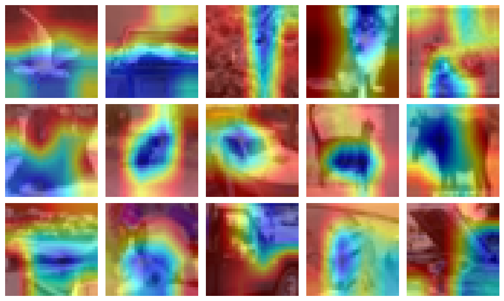
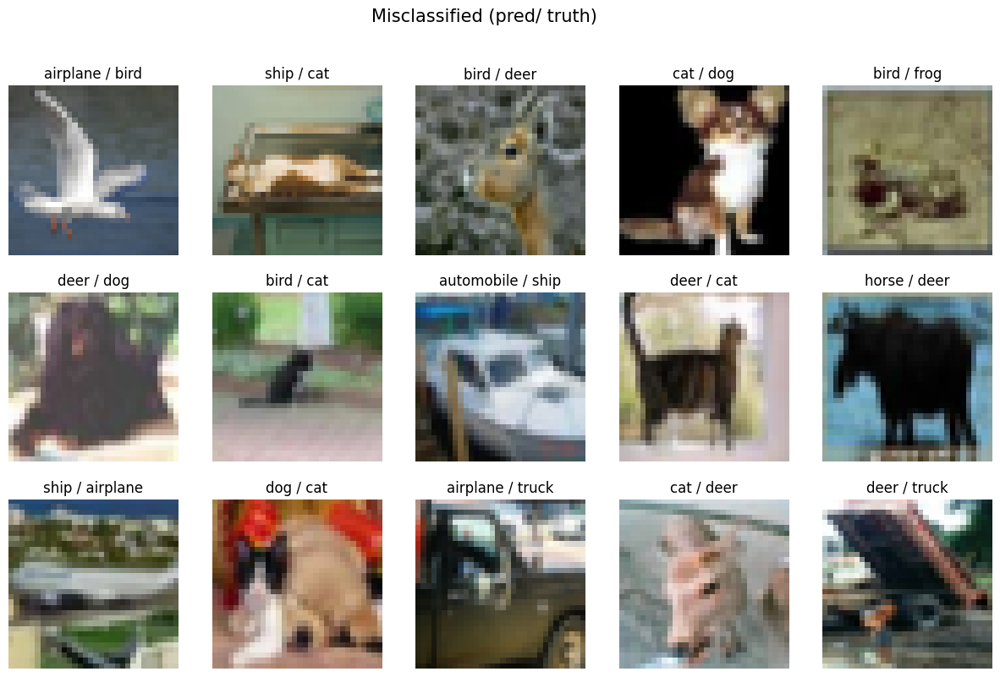
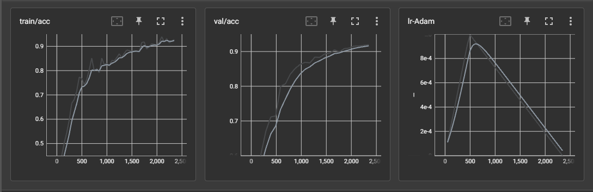

# Assignment 12 Submission: `way to lightning`

<br>

- [try on spaces](https://huggingface.co/spaces/anantgupta129/miniresnet_gradcam) 
- [main repo](https://github.com/anantgupta129/TorcHood) 
- [training notebook](https://colab.research.google.com/github/anantgupta129/ERA-V1/blob/main/session12/notebooks/s12_train.ipynb)

## Results

```bash
[x] Accuracy of ::
	[*] airplane : 94 %
	[*] automobile : 100 %
	[*]     bird : 81 %
	[*]      cat : 84 %
	[*]     deer : 95 %
	[*]      dog : 75 %
	[*]     frog : 84 %
	[*]    horse : 95 %
	[*]     ship : 100 %
	[*]    truck : 91 %
```

## Grad Cam Results



## Misclassified Images



## Learning Curve



## Model Summary

```bash
==========================================================================================
Layer (type:depth-idx)                   Output Shape              Param #
==========================================================================================
CustomResNet                             [1, 10]                   --
├─Sequential: 1-1                        [1, 64, 32, 32]           --
│    └─Conv2d: 2-1                       [1, 64, 32, 32]           1,728
│    └─BatchNorm2d: 2-2                  [1, 64, 32, 32]           128
│    └─ReLU: 2-3                         [1, 64, 32, 32]           --
│    └─Dropout2d: 2-4                    [1, 64, 32, 32]           --
├─Sequential: 1-2                        [1, 128, 16, 16]          --
│    └─Conv2d: 2-5                       [1, 128, 32, 32]          73,728
│    └─MaxPool2d: 2-6                    [1, 128, 16, 16]          --
│    └─BatchNorm2d: 2-7                  [1, 128, 16, 16]          256
│    └─ReLU: 2-8                         [1, 128, 16, 16]          --
│    └─Dropout2d: 2-9                    [1, 128, 16, 16]          --
│    └─ResBlock: 2-10                    [1, 128, 16, 16]          --
│    │    └─Conv2d: 3-1                  [1, 128, 16, 16]          147,456
│    │    └─BatchNorm2d: 3-2             [1, 128, 16, 16]          256
│    │    └─Dropout2d: 3-3               [1, 128, 16, 16]          --
│    │    └─Conv2d: 3-4                  [1, 128, 16, 16]          147,456
│    │    └─BatchNorm2d: 3-5             [1, 128, 16, 16]          256
│    │    └─Dropout2d: 3-6               [1, 128, 16, 16]          --
├─Sequential: 1-3                        [1, 256, 8, 8]            --
│    └─Conv2d: 2-11                      [1, 256, 16, 16]          294,912
│    └─MaxPool2d: 2-12                   [1, 256, 8, 8]            --
│    └─BatchNorm2d: 2-13                 [1, 256, 8, 8]            512
│    └─ReLU: 2-14                        [1, 256, 8, 8]            --
│    └─Dropout2d: 2-15                   [1, 256, 8, 8]            --
├─Sequential: 1-4                        [1, 512, 4, 4]            --
│    └─Conv2d: 2-16                      [1, 512, 8, 8]            1,179,648
│    └─MaxPool2d: 2-17                   [1, 512, 4, 4]            --
│    └─BatchNorm2d: 2-18                 [1, 512, 4, 4]            1,024
│    └─ReLU: 2-19                        [1, 512, 4, 4]            --
│    └─Dropout2d: 2-20                   [1, 512, 4, 4]            --
│    └─ResBlock: 2-21                    [1, 512, 4, 4]            --
│    │    └─Conv2d: 3-7                  [1, 512, 4, 4]            2,359,296
│    │    └─BatchNorm2d: 3-8             [1, 512, 4, 4]            1,024
│    │    └─Dropout2d: 3-9               [1, 512, 4, 4]            --
│    │    └─Conv2d: 3-10                 [1, 512, 4, 4]            2,359,296
│    │    └─BatchNorm2d: 3-11            [1, 512, 4, 4]            1,024
│    │    └─Dropout2d: 3-12              [1, 512, 4, 4]            --
├─MaxPool2d: 1-5                         [1, 512, 1, 1]            --
├─Conv2d: 1-6                            [1, 10, 1, 1]             5,120
==========================================================================================
Total params: 6,573,120
Trainable params: 6,573,120
Non-trainable params: 0
Total mult-adds (M): 379.27
==========================================================================================
Input size (MB): 0.01
Forward/backward pass size (MB): 4.65
Params size (MB): 26.29
Estimated Total Size (MB): 30.96
==========================================================================================
```


## Training Logs

```bash
Epoch 0/23 ━━━━━━━━━━━━━━━━━━━━━━━━━━━━━━━━━━ 98/98 0:00:22 • 0:00:00 4.44it/s v_num: 0 train/loss: 1.559          
                                                                               train/acc: 0.399                    
Epoch 1/23 ━━━━━━━━━━━━━━━━━━━━━━━━━━━━━━━━━━ 98/98 0:00:25 • 0:00:00 4.00it/s v_num: 0 train/loss: 1.2 train/acc: 
                                                                               0.551 val/loss: 1.361 val/acc: 0.51 
Epoch 2/23 ━━━━━━━━━━━━━━━━━━━━━━━━━━━━━━━━━━ 98/98 0:00:23 • 0:00:00 4.25it/s v_num: 0 train/loss: 1.027          
                                                                               train/acc: 0.631 val/loss: 1.109    
                                                                               val/acc: 0.605                      
Epoch 3/23 ━━━━━━━━━━━━━━━━━━━━━━━━━━━━━━━━━━ 98/98 0:00:22 • 0:00:00 4.40it/s v_num: 0 train/loss: 0.819          
                                                                               train/acc: 0.72 val/loss: 0.966     
                                                                               val/acc: 0.67                       
Epoch 4/23 ━━━━━━━━━━━━━━━━━━━━━━━━━━━━━━━━━━ 98/98 0:00:23 • 0:00:00 4.23it/s v_num: 0 train/loss: 0.66 train/acc:
                                                                               0.777 val/loss: 0.899 val/acc: 0.712
Epoch 5/23 ━━━━━━━━━━━━━━━━━━━━━━━━━━━━━━━━━━ 98/98 0:00:23 • 0:00:00 4.24it/s v_num: 0 train/loss: 0.67 train/acc:
                                                                               0.777 val/loss: 0.861 val/acc: 0.714
Epoch 6/23 ━━━━━━━━━━━━━━━━━━━━━━━━━━━━━━━━━━ 98/98 0:00:22 • 0:00:00 4.39it/s v_num: 0 train/loss: 0.596          
                                                                               train/acc: 0.804 val/loss: 0.594    
                                                                               val/acc: 0.8                        
Epoch 7/23 ━━━━━━━━━━━━━━━━━━━━━━━━━━━━━━━━━━ 98/98 0:00:23 • 0:00:00 4.21it/s v_num: 0 train/loss: 0.612          
                                                                               train/acc: 0.801 val/loss: 0.581    
                                                                               val/acc: 0.807                      
Epoch 8/23 ━━━━━━━━━━━━━━━━━━━━━━━━━━━━━━━━━━ 98/98 0:00:23 • 0:00:00 4.31it/s v_num: 0 train/loss: 0.555          
                                                                               train/acc: 0.795 val/loss: 0.502    
                                                                               val/acc: 0.835                      
Epoch 9/23 ━━━━━━━━━━━━━━━━━━━━━━━━━━━━━━━━━━ 98/98 0:00:22 • 0:00:00 4.35it/s v_num: 0 train/loss: 0.483          
                                                                               train/acc: 0.83 val/loss: 0.439     
                                                                               val/acc: 0.852                      
Epoch 10/23 ━━━━━━━━━━━━━━━━━━━━━━━━━━━━━━━━━━ 98/98 0:00:23 • 0:00:00 4.21it/s v_num: 0 train/loss: 0.453         
                                                                                train/acc: 0.824 val/loss: 0.407   
                                                                                val/acc: 0.863                     
Epoch 11/23 ━━━━━━━━━━━━━━━━━━━━━━━━━━━━━━━━━━ 98/98 0:00:22 • 0:00:00 4.34it/s v_num: 0 train/loss: 0.372         
                                                                                train/acc: 0.866 val/loss: 0.396   
                                                                                val/acc: 0.869                     
Epoch 12/23 ━━━━━━━━━━━━━━━━━━━━━━━━━━━━━━━━━━ 98/98 0:00:22 • 0:00:00 4.38it/s v_num: 0 train/loss: 0.376         
                                                                                train/acc: 0.863 val/loss: 0.409   
                                                                                val/acc: 0.867                     
Epoch 13/23 ━━━━━━━━━━━━━━━━━━━━━━━━━━━━━━━━━━ 98/98 0:00:24 • 0:00:00 4.17it/s v_num: 0 train/loss: 0.432         
                                                                                train/acc: 0.854 val/loss: 0.347   
                                                                                val/acc: 0.884                     
Epoch 14/23 ━━━━━━━━━━━━━━━━━━━━━━━━━━━━━━━━━━ 98/98 0:00:22 • 0:00:00 4.32it/s v_num: 0 train/loss: 0.397         
                                                                                train/acc: 0.857 val/loss: 0.352   
                                                                                val/acc: 0.883                     
Epoch 15/23 ━━━━━━━━━━━━━━━━━━━━━━━━━━━━━━━━━━ 98/98 0:00:22 • 0:00:00 4.38it/s v_num: 0 train/loss: 0.356         
                                                                                train/acc: 0.878 val/loss: 0.32    
                                                                                val/acc: 0.893                     
Epoch 16/23 ━━━━━━━━━━━━━━━━━━━━━━━━━━━━━━━━━━ 98/98 0:00:23 • 0:00:00 4.17it/s v_num: 0 train/loss: 0.307         
                                                                                train/acc: 0.89 val/loss: 0.311    
                                                                                val/acc: 0.895                     
Epoch 17/23 ━━━━━━━━━━━━━━━━━━━━━━━━━━━━━━━━━━ 98/98 0:00:22 • 0:00:00 4.36it/s v_num: 0 train/loss: 0.263         
                                                                                train/acc: 0.908 val/loss: 0.286   
                                                                                val/acc: 0.905                     
Epoch 18/23 ━━━━━━━━━━━━━━━━━━━━━━━━━━━━━━━━━━ 98/98 0:00:23 • 0:00:00 4.36it/s v_num: 0 train/loss: 0.3 train/acc:
                                                                                0.899 val/loss: 0.295 val/acc:     
                                                                                0.899                              
Epoch 19/23 ━━━━━━━━━━━━━━━━━━━━━━━━━━━━━━━━━━ 98/98 0:00:23 • 0:00:00 4.18it/s v_num: 0 train/loss: 0.283         
                                                                                train/acc: 0.89 val/loss: 0.277    
                                                                                val/acc: 0.908                     
Epoch 20/23 ━━━━━━━━━━━━━━━━━━━━━━━━━━━━━━━━━━ 98/98 0:00:22 • 0:00:00 4.39it/s v_num: 0 train/loss: 0.3 train/acc:
                                                                                0.911 val/loss: 0.261 val/acc: 0.91
Epoch 21/23 ━━━━━━━━━━━━━━━━━━━━━━━━━━━━━━━━━━ 98/98 0:00:23 • 0:00:00 4.29it/s v_num: 0 train/loss: 0.242         
                                                                                train/acc: 0.914 val/loss: 0.26    
                                                                                val/acc: 0.916                     
Epoch 22/23 ━━━━━━━━━━━━━━━━━━━━━━━━━━━━━━━━━━ 98/98 0:00:23 • 0:00:00 4.21it/s v_num: 0 train/loss: 0.185         
                                                                                train/acc: 0.949 val/loss: 0.248   
                                                                                val/acc: 0.916                     
Epoch 23/23 ━━━━━━━━━━━━━━━━━━━━━━━━━━━━━━━━━━ 98/98 0:00:22 • 0:00:00 4.37it/s v_num: 0 train/loss: 0.212         
                                                                                train/acc: 0.938 val/loss: 0.245   
                                                                                val/acc: 0.918                    
```
