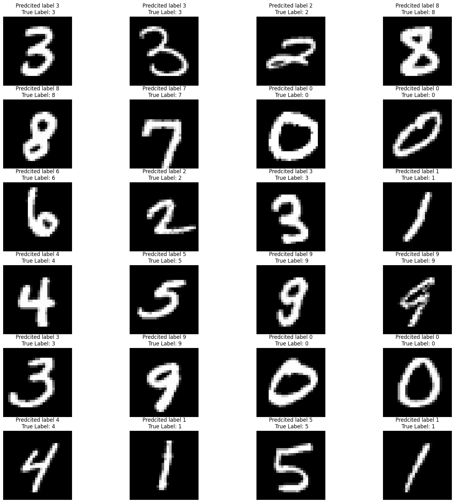

# MNIST: Assignment 5

# Requirements

```
torch
torchvision
numpy
Pillow
```

# Model Summary

```
----------------------------------------------------------------
        Layer (type)               Output Shape         Param #
================================================================
            Conv2d-1           [-1, 32, 26, 26]             288
            Conv2d-2           [-1, 64, 24, 24]          18,432
            Conv2d-3          [-1, 128, 10, 10]          73,728
            Conv2d-4            [-1, 256, 8, 8]         294,912
            Linear-5                   [-1, 50]         204,800
            Linear-6                   [-1, 10]             500
================================================================
Total params: 592,660
Trainable params: 592,660
Non-trainable params: 0
----------------------------------------------------------------
Input size (MB): 0.00
Forward/backward pass size (MB): 0.67
Params size (MB): 2.26
Estimated Total Size (MB): 2.93
----------------------------------------------------------------
```

# Model Learning Curve


# Model Output



# Training Log

```
Adjusting learning rate of group 0 to 1.0000e-02.
Epoch 11
Train: Loss=0.0532 Batch_id=117 Accuracy=98.53: 100%|██████████| 118/118 [00:08<00:00, 13.70it/s]
Test set: Average loss: 0.0290, Accuracy: 9904/10000 (99.04%)

Adjusting learning rate of group 0 to 1.0000e-02.
Epoch 12
Train: Loss=0.0202 Batch_id=117 Accuracy=98.69: 100%|██████████| 118/118 [00:08<00:00, 13.94it/s]
Test set: Average loss: 0.0298, Accuracy: 9901/10000 (99.01%)

Adjusting learning rate of group 0 to 1.0000e-02.
Epoch 13
Train: Loss=0.0640 Batch_id=117 Accuracy=98.62: 100%|██████████| 118/118 [00:08<00:00, 13.80it/s]
Test set: Average loss: 0.0265, Accuracy: 9909/10000 (99.09%)

Adjusting learning rate of group 0 to 1.0000e-02.
Epoch 14
Train: Loss=0.0135 Batch_id=117 Accuracy=98.82: 100%|██████████| 118/118 [00:08<00:00, 13.32it/s]
Test set: Average loss: 0.0280, Accuracy: 9901/10000 (99.01%)

Adjusting learning rate of group 0 to 1.0000e-02.
Epoch 15
Train: Loss=0.0357 Batch_id=117 Accuracy=98.81: 100%|██████████| 118/118 [00:08<00:00, 14.17it/s]
Test set: Average loss: 0.0358, Accuracy: 9871/10000 (98.71%)

Adjusting learning rate of group 0 to 1.0000e-03.
Epoch 16
Train: Loss=0.0038 Batch_id=117 Accuracy=99.01: 100%|██████████| 118/118 [00:08<00:00, 14.31it/s]
Test set: Average loss: 0.0220, Accuracy: 9927/10000 (99.27%)

Adjusting learning rate of group 0 to 1.0000e-03.
Epoch 17
Train: Loss=0.0140 Batch_id=117 Accuracy=99.14: 100%|██████████| 118/118 [00:09<00:00, 12.94it/s]
Test set: Average loss: 0.0215, Accuracy: 9924/10000 (99.24%)

Adjusting learning rate of group 0 to 1.0000e-03.
Epoch 18
Train: Loss=0.0231 Batch_id=117 Accuracy=99.17: 100%|██████████| 118/118 [00:08<00:00, 13.98it/s]
Test set: Average loss: 0.0212, Accuracy: 9921/10000 (99.21%)

Adjusting learning rate of group 0 to 1.0000e-03.
Epoch 19
Train: Loss=0.0032 Batch_id=117 Accuracy=99.13: 100%|██████████| 118/118 [00:08<00:00, 13.71it/s]
Test set: Average loss: 0.0216, Accuracy: 9922/10000 (99.22%)

Adjusting learning rate of group 0 to 1.0000e-03.
Epoch 20
Train: Loss=0.0493 Batch_id=117 Accuracy=99.13: 100%|██████████| 118/118 [00:09<00:00, 12.32it/s]
Test set: Average loss: 0.0216, Accuracy: 9922/10000 (99.22%)


```
