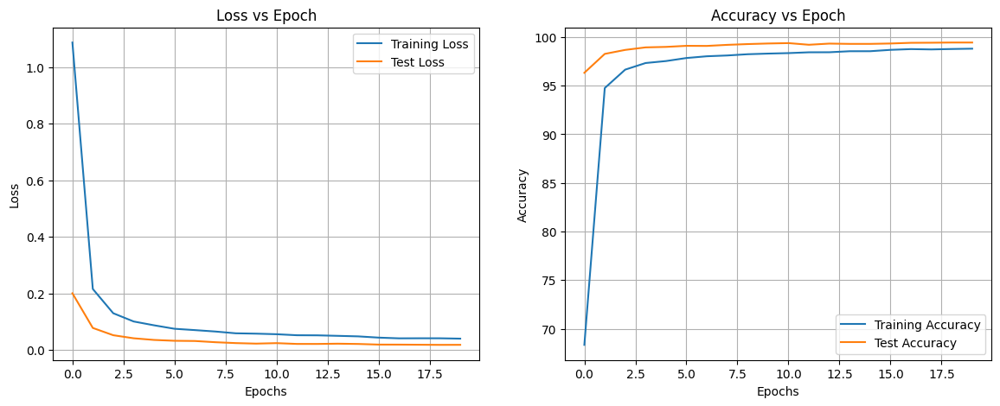
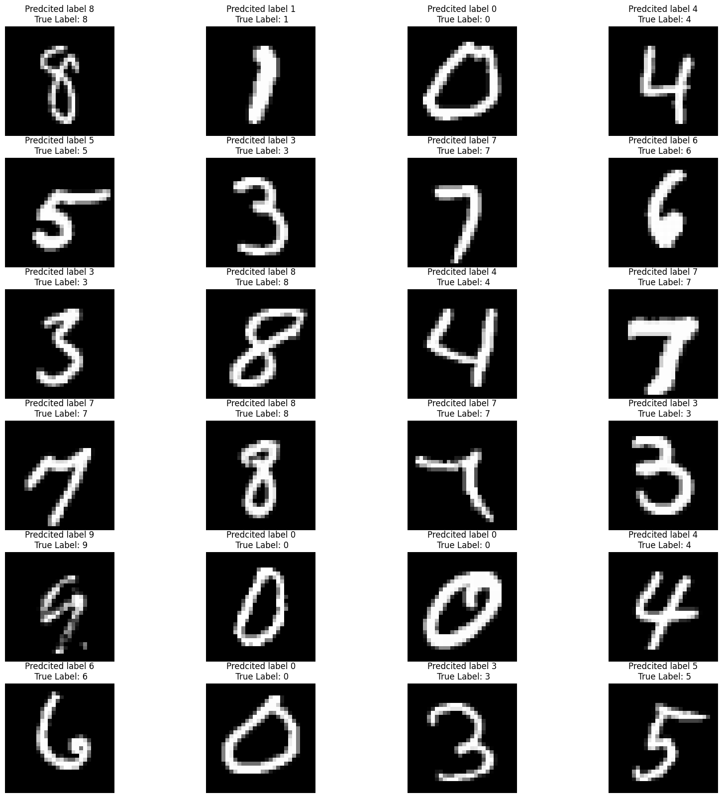

# MNIST less then 20k

[Notebook](./S6_net_final.ipynb)

- New and [improved model](./model.py#L91) has **12,116** parameters with max accuracy of **99.54%**
- older network had total **16,034** parameters in networks. achieved validation accuracy of **99.4%** in 17 epoch with max **99.43%**
- Dropout of **0.01** is used every layer (except after fully connected layer).

## Model Summary

```
----------------------------------------------------------------
        Layer (type)               Output Shape         Param #
================================================================
            Conv2d-1            [-1, 4, 28, 28]              36
              ReLU-2            [-1, 4, 28, 28]               0
       BatchNorm2d-3            [-1, 4, 28, 28]               8
         Dropout2d-4            [-1, 4, 28, 28]               0
            Conv2d-5            [-1, 8, 26, 26]             288
              ReLU-6            [-1, 8, 26, 26]               0
       BatchNorm2d-7            [-1, 8, 26, 26]              16
         Dropout2d-8            [-1, 8, 26, 26]               0
         MaxPool2d-9            [-1, 8, 13, 13]               0
           Conv2d-10            [-1, 4, 13, 13]              32
             ReLU-11            [-1, 4, 13, 13]               0
      BatchNorm2d-12            [-1, 4, 13, 13]               8
        Dropout2d-13            [-1, 4, 13, 13]               0
           Conv2d-14           [-1, 16, 11, 11]             576
             ReLU-15           [-1, 16, 11, 11]               0
      BatchNorm2d-16           [-1, 16, 11, 11]              32
        Dropout2d-17           [-1, 16, 11, 11]               0
           Conv2d-18             [-1, 32, 9, 9]           4,608
             ReLU-19             [-1, 32, 9, 9]               0
      BatchNorm2d-20             [-1, 32, 9, 9]              64
        Dropout2d-21             [-1, 32, 9, 9]               0
           Conv2d-22              [-1, 8, 9, 9]             256
             ReLU-23              [-1, 8, 9, 9]               0
      BatchNorm2d-24              [-1, 8, 9, 9]              16
        Dropout2d-25              [-1, 8, 9, 9]               0
           Conv2d-26             [-1, 16, 7, 7]           1,152
             ReLU-27             [-1, 16, 7, 7]               0
      BatchNorm2d-28             [-1, 16, 7, 7]              32
        Dropout2d-29             [-1, 16, 7, 7]               0
           Conv2d-30             [-1, 32, 5, 5]           4,608
             ReLU-31             [-1, 32, 5, 5]               0
      BatchNorm2d-32             [-1, 32, 5, 5]              64
        Dropout2d-33             [-1, 32, 5, 5]               0
        AvgPool2d-34             [-1, 32, 1, 1]               0
           Conv2d-35             [-1, 10, 1, 1]             320
================================================================
Total params: 12,116
Trainable params: 12,116
Non-trainable params: 0
----------------------------------------------------------------
Input size (MB): 0.00
Forward/backward pass size (MB): 0.50
Params size (MB): 0.05
Estimated Total Size (MB): 0.55
----------------------------------------------------------------
```

## Learning Curve




