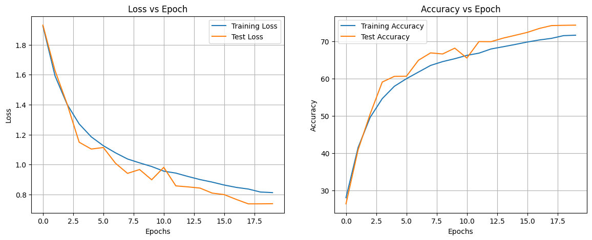
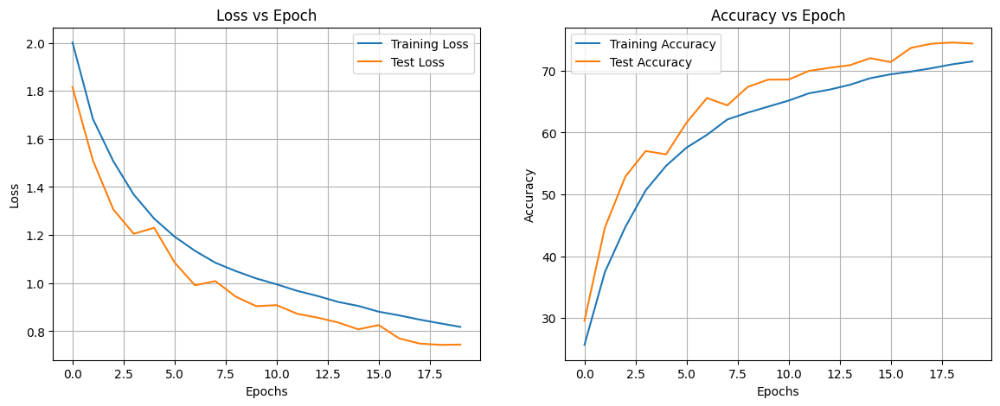
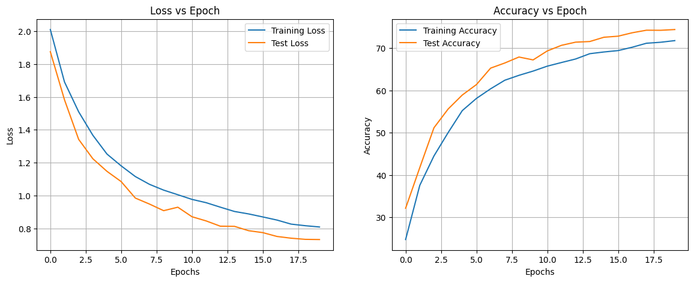
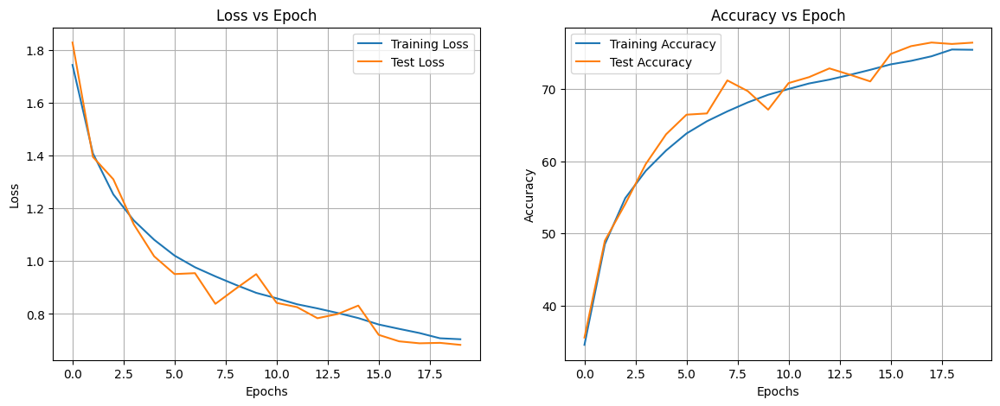
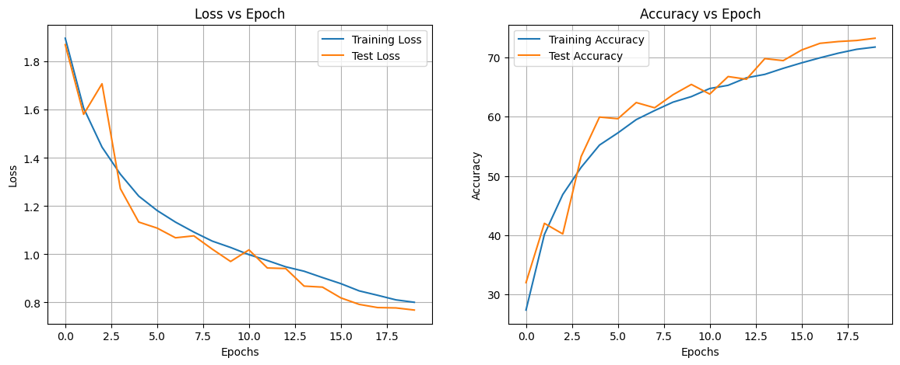
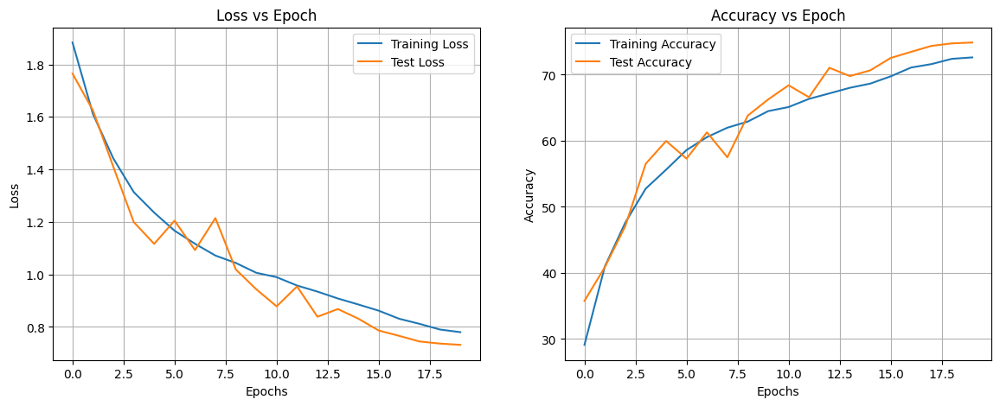
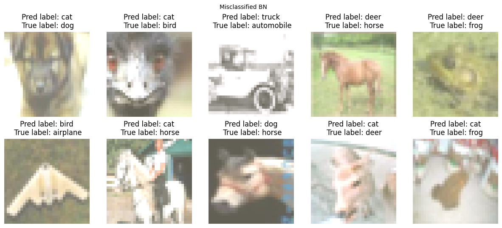
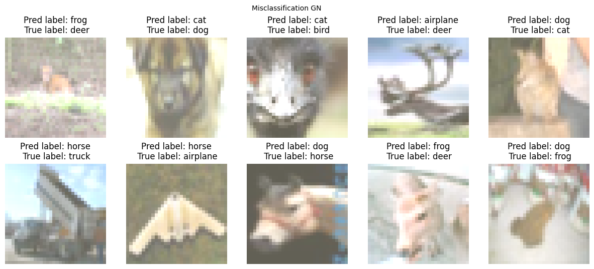
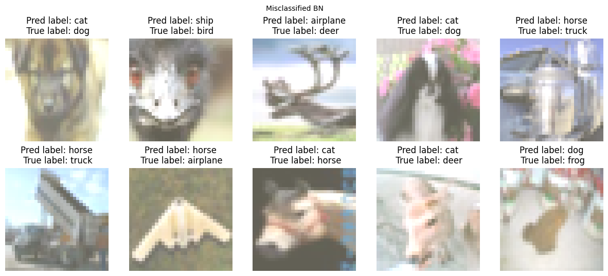

# Submission Assignment 8

## Result

| Model                | Training Acc | Test Acc |
|----------------------|--------------|----------|
| [BN](./notebooks/bn.ipynb)                   | 71.65        | 74.35    |
| [GN](./notebooks/gn.ipynb)                   | 71.73        | 74.35    | 
| [LN](./notebooks/ln.ipynb)                   | 71.50        | 74.56    |
| [BN + Skip Connection](./notebooks/bn_skip.ipynb) | 75.45        | 76.42    |  
| [GN + Skip](./notebooks/gn_skip.ipynb)            | 72.61        | 74.86    |  
| [LN + Skip](./notebooks/ln_skip.ipynb)            | 71.76        | 73.25    |


```
==========================================================================================
Layer (type:depth-idx)                   Output Shape              Param #
==========================================================================================
SkipNet                                  [1, 10]                   --
├─Sequential: 1-1                        [1, 16, 32, 32]           --
│    └─Conv2d: 2-1                       [1, 8, 32, 32]            216
│    └─ReLU: 2-2                         [1, 8, 32, 32]            --
│    └─BatchNorm2d: 2-3                  [1, 8, 32, 32]            16
│    └─Dropout2d: 2-4                    [1, 8, 32, 32]            --
│    └─Conv2d: 2-5                       [1, 16, 32, 32]           1,152
│    └─ReLU: 2-6                         [1, 16, 32, 32]           --
│    └─BatchNorm2d: 2-7                  [1, 16, 32, 32]           32
│    └─Dropout2d: 2-8                    [1, 16, 32, 32]           --
├─Sequential: 1-2                        [1, 8, 16, 16]            --
│    └─Conv2d: 2-9                       [1, 8, 32, 32]            128
│    └─ReLU: 2-10                        [1, 8, 32, 32]            --
│    └─Dropout2d: 2-11                   [1, 8, 32, 32]            --
│    └─MaxPool2d: 2-12                   [1, 8, 16, 16]            --
├─Bottleneck: 1-3                        [1, 32, 16, 16]           --
│    └─Conv2d: 2-13                      [1, 16, 16, 16]           1,152
│    └─BatchNorm2d: 2-14                 [1, 16, 16, 16]           32
│    └─Dropout2d: 2-15                   [1, 16, 16, 16]           --
│    └─Conv2d: 2-16                      [1, 24, 16, 16]           3,456
│    └─BatchNorm2d: 2-17                 [1, 24, 16, 16]           48
│    └─Dropout2d: 2-18                   [1, 24, 16, 16]           --
│    └─Conv2d: 2-19                      [1, 32, 16, 16]           6,912
│    └─BatchNorm2d: 2-20                 [1, 32, 16, 16]           64
│    └─Sequential: 2-21                  [1, 32, 16, 16]           --
│    │    └─Conv2d: 3-1                  [1, 32, 16, 16]           256
│    │    └─BatchNorm2d: 3-2             [1, 32, 16, 16]           64
│    └─Dropout2d: 2-22                   [1, 32, 16, 16]           --
├─Sequential: 1-4                        [1, 8, 8, 8]              --
│    └─Conv2d: 2-23                      [1, 8, 16, 16]            256
│    └─ReLU: 2-24                        [1, 8, 16, 16]            --
│    └─Dropout2d: 2-25                   [1, 8, 16, 16]            --
│    └─MaxPool2d: 2-26                   [1, 8, 8, 8]              --
├─Bottleneck: 1-5                        [1, 48, 8, 8]             --
│    └─Conv2d: 2-27                      [1, 16, 8, 8]             1,152
│    └─BatchNorm2d: 2-28                 [1, 16, 8, 8]             32
│    └─Dropout2d: 2-29                   [1, 16, 8, 8]             --
│    └─Conv2d: 2-30                      [1, 32, 8, 8]             4,608
│    └─BatchNorm2d: 2-31                 [1, 32, 8, 8]             64
│    └─Dropout2d: 2-32                   [1, 32, 8, 8]             --
│    └─Conv2d: 2-33                      [1, 48, 8, 8]             13,824
│    └─BatchNorm2d: 2-34                 [1, 48, 8, 8]             96
│    └─Sequential: 2-35                  [1, 48, 8, 8]             --
│    │    └─Conv2d: 3-3                  [1, 48, 8, 8]             384
│    │    └─BatchNorm2d: 3-4             [1, 48, 8, 8]             96
│    └─Dropout2d: 2-36                   [1, 48, 8, 8]             --
├─Sequential: 1-6                        [1, 10, 1, 1]             --
│    └─AvgPool2d: 2-37                   [1, 48, 1, 1]             --
│    └─Conv2d: 2-38                      [1, 10, 1, 1]             480
==========================================================================================
Total params: 34,520
Trainable params: 34,520
Non-trainable params: 0
Total mult-adds (M): 5.89
==========================================================================================
Input size (MB): 0.01
Forward/backward pass size (MB): 1.05
Params size (MB): 0.14
Estimated Total Size (MB): 1.20
==========================================================================================
```
## Understanding Different Normalization


| Normalization type | How it works	| Observations |
| :------: | :-------: | :-------: |
| **Group Normalization** |	Create group of channels, and normalize each group, computation is independent of batch sizes | Training started with underfitted model but after few epochs the training got stable. The difference between training accuracy and testing accuracy was comparatively less. Experiment were conducted using 2 and 4 groups, 4 showed better result. |
| **Layer Normalization** |	Normalizes all the activation of single layers. potential of normalizing the hidden states. |	Compared to group normalization the distance between training and testing accuracy was larger. But at the end the training logs are better compare to group normalization. |
| **Batch Normalization**	| Normalizes the layers input rescaling and re-centering the images. | low dropout value was better than no dropout at all |


## Learning Curve

<br>

| BN     | LN      |
| ------------------------------------------------------------ | ---------------------------------------------------------- |
|  |  |  |


| GN    | BN + Skip   | 
| ------------------------------------------------------------ | ---------------------------------------------------------- |
|  |  | 


| LN + Skip      | GN + Skip  |
| ------------------------------------------------------------ | ---------------------------------------------------------- |
|  |  |


## Missclassification 

## BN 


## GN 



## LN 
