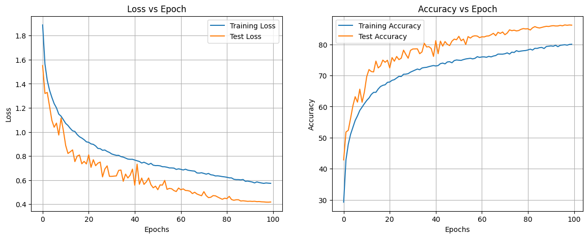
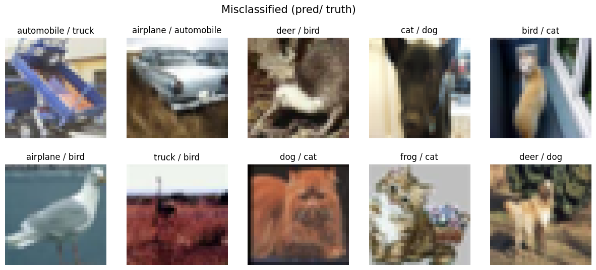

# Assignment 9 Submission

The Receptive Field (RF) parameter played a crucial role in achieving high accuracy. Initially, the model was designed based on the number of parameters alone, resulting in poor performance after training. To address this, a table was created to calculate the Receptive Field and monitor its effectiveness. It was observed that increasing the parameters without increasing the RF did not lead to improved accuracy.

To enhance the model, the following techniques were implemented:

1. Additional Convolution Layer: An extra pure convolutional layer was included before the first transition block, which positively impacted the model's performance.

2. Dilated Kernel Replacement: Replacing the Max Pooling layer with a dilated kernel presented a challenge. Through research, it was discovered that utilizing a series of dilated kernels, known as hybrid dilated convolution (HDC), could effectively cover every pixel point on the image, reducing information loss.

$$
n\_{out} = \\frac{{n\_{in} + 2p - f}}{{s}} + 1
$$

$$
n\_{in} = 16 | n\_{out} = 8
$$

$$
8 = \\frac{16 +2\*0 - f}{1} + 1
$$

$$
f = 9
$$

<center>filter of 9 is required</center>

$$
k\_{eff} = k + (k-1)(rate - 1) \\
9 = 3 + (3-1)(rate - 1) \\
rate = 4
$$

<center>dilation needed is 4</center>

## Model Summary

[training notebook](./notebooks/train.ipynb) | [model file](./models/light.py)

*Total 65k parameters with 86.25% test accuracy*

| Set   | Max Acc@Epoch | Last Epoch Acc |
| ----- | ------------- | -------------- |
| train | 80.04@100     | 80.04          |
| test  | 86.25@97      | 86.18          |

```bash
==========================================================================================
Layer (type:depth-idx)                   Output Shape              Param #
==========================================================================================
Net                                      [1, 10]                   --
├─Sequential: 1-1                        [1, 32, 16, 16]           --
│    └─Conv2d: 2-1                       [1, 32, 32, 32]           864
│    └─BatchNorm2d: 2-2                  [1, 32, 32, 32]           64
│    └─ReLU: 2-3                         [1, 32, 32, 32]           --
│    └─Dropout2d: 2-4                    [1, 32, 32, 32]           --
│    └─DepthwiseSeparable: 2-5           [1, 32, 32, 32]           --
│    │    └─Conv2d: 3-1                  [1, 32, 32, 32]           288
│    │    └─Conv2d: 3-2                  [1, 32, 32, 32]           1,024
│    └─BatchNorm2d: 2-6                  [1, 32, 32, 32]           64
│    └─ReLU: 2-7                         [1, 32, 32, 32]           --
│    └─Dropout2d: 2-8                    [1, 32, 32, 32]           --
│    └─Conv2d: 2-9                       [1, 32, 16, 16]           9,216
│    └─BatchNorm2d: 2-10                 [1, 32, 16, 16]           64
│    └─ReLU: 2-11                        [1, 32, 16, 16]           --
│    └─Dropout2d: 2-12                   [1, 32, 16, 16]           --
├─Sequential: 1-2                        [1, 16, 16, 16]           --
│    └─Conv2d: 2-13                      [1, 16, 16, 16]           512
│    └─ReLU: 2-14                        [1, 16, 16, 16]           --
├─Sequential: 1-3                        [1, 32, 8, 8]             --
│    └─Conv2d: 2-15                      [1, 32, 16, 16]           4,608
│    └─BatchNorm2d: 2-16                 [1, 32, 16, 16]           64
│    └─ReLU: 2-17                        [1, 32, 16, 16]           --
│    └─Dropout2d: 2-18                   [1, 32, 16, 16]           --
│    └─DepthwiseSeparable: 2-19          [1, 32, 16, 16]           --
│    │    └─Conv2d: 3-3                  [1, 32, 16, 16]           288
│    │    └─Conv2d: 3-4                  [1, 32, 16, 16]           1,024
│    └─BatchNorm2d: 2-20                 [1, 32, 16, 16]           64
│    └─ReLU: 2-21                        [1, 32, 16, 16]           --
│    └─Dropout2d: 2-22                   [1, 32, 16, 16]           --
│    └─PoolWithDilation: 2-23            [1, 32, 8, 8]             --
│    │    └─Conv2d: 3-5                  [1, 32, 12, 12]           9,216
│    │    └─Conv2d: 3-6                  [1, 32, 8, 8]             9,216
│    └─BatchNorm2d: 2-24                 [1, 32, 8, 8]             64
│    └─ReLU: 2-25                        [1, 32, 8, 8]             --
│    └─Dropout2d: 2-26                   [1, 32, 8, 8]             --
├─Sequential: 1-4                        [1, 16, 8, 8]             --
│    └─Conv2d: 2-27                      [1, 16, 8, 8]             512
│    └─ReLU: 2-28                        [1, 16, 8, 8]             --
├─Sequential: 1-5                        [1, 128, 8, 8]            --
│    └─Conv2d: 2-29                      [1, 32, 8, 8]             4,608
│    └─BatchNorm2d: 2-30                 [1, 32, 8, 8]             64
│    └─ReLU: 2-31                        [1, 32, 8, 8]             --
│    └─Dropout2d: 2-32                   [1, 32, 8, 8]             --
│    └─DepthwiseSeparable: 2-33          [1, 64, 8, 8]             --
│    │    └─Conv2d: 3-7                  [1, 32, 8, 8]             288
│    │    └─Conv2d: 3-8                  [1, 64, 8, 8]             2,048
│    └─BatchNorm2d: 2-34                 [1, 64, 8, 8]             128
│    └─ReLU: 2-35                        [1, 64, 8, 8]             --
│    └─Dropout2d: 2-36                   [1, 64, 8, 8]             --
│    └─DepthwiseSeparable: 2-37          [1, 128, 8, 8]            --
│    │    └─Conv2d: 3-9                  [1, 64, 8, 8]             576
│    │    └─Conv2d: 3-10                 [1, 128, 8, 8]            8,192
│    └─BatchNorm2d: 2-38                 [1, 128, 8, 8]            256
│    └─ReLU: 2-39                        [1, 128, 8, 8]            --
│    └─Dropout2d: 2-40                   [1, 128, 8, 8]            --
├─Sequential: 1-6                        [1, 32, 8, 8]             --
│    └─Conv2d: 2-41                      [1, 32, 8, 8]             4,096
│    └─ReLU: 2-42                        [1, 32, 8, 8]             --
├─Sequential: 1-7                        [1, 10, 1, 1]             --
│    └─DepthwiseSeparable: 2-43          [1, 64, 6, 6]             --
│    │    └─Conv2d: 3-11                 [1, 32, 6, 6]             288
│    │    └─Conv2d: 3-12                 [1, 64, 6, 6]             2,048
│    └─BatchNorm2d: 2-44                 [1, 64, 6, 6]             128
│    └─ReLU: 2-45                        [1, 64, 6, 6]             --
│    └─Dropout2d: 2-46                   [1, 64, 6, 6]             --
│    └─DepthwiseSeparable: 2-47          [1, 64, 4, 4]             --
│    │    └─Conv2d: 3-13                 [1, 64, 4, 4]             576
│    │    └─Conv2d: 3-14                 [1, 64, 4, 4]             4,096
│    └─BatchNorm2d: 2-48                 [1, 64, 4, 4]             128
│    └─ReLU: 2-49                        [1, 64, 4, 4]             --
│    └─Dropout2d: 2-50                   [1, 64, 4, 4]             --
│    └─AvgPool2d: 2-51                   [1, 64, 1, 1]             --
│    └─Conv2d: 2-52                      [1, 10, 1, 1]             640
==========================================================================================
Total params: 65,312
Trainable params: 65,312
Non-trainable params: 0
Total mult-adds (M): 9.61
==========================================================================================
Input size (MB): 0.01
Forward/backward pass size (MB): 2.25
Params size (MB): 0.26
Estimated Total Size (MB): 2.52
==========================================================================================
```

## Per Class Accuracy

```bash
[x] Accuracy of ::
	[*] airplane : 88 %
	[*] automobile : 96 %
	[*]     bird : 81 %
	[*]      cat : 73 %
	[*]     deer : 78 %
	[*]      dog : 80 %
	[*]     frog : 91 %
	[*]    horse : 88 %
	[*]     ship : 94 %
	[*]    truck : 91 %
```

## Learning Curve



## Missclassification Curve


